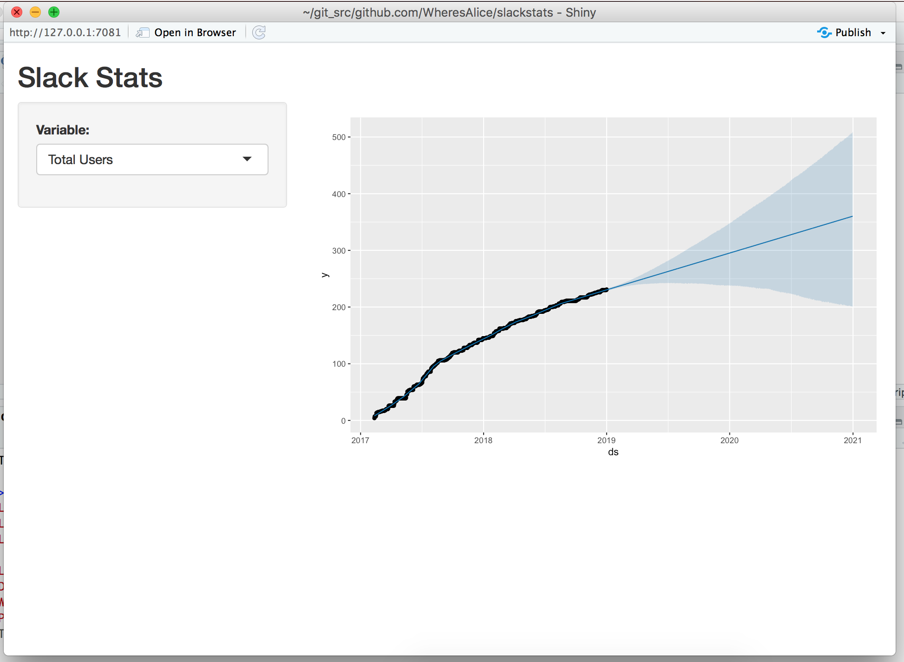

## Slack Stats

This is a Shiny app for predicting the next two years of your Slack organisation.  An example output can be seen here <https://wheresalice.shinyapps.io/slackstats/>

Since the app does some very heavy work on predicting on graph-render, it is pretty slow to load.

## Usage

0. `git clone` this repository
1. Download a CSV file from <https://my.slack.com/stats>
2. Put this in this repository's directory as `slack.csv`
3. `docker-compose up`
4. `open http://localhost`